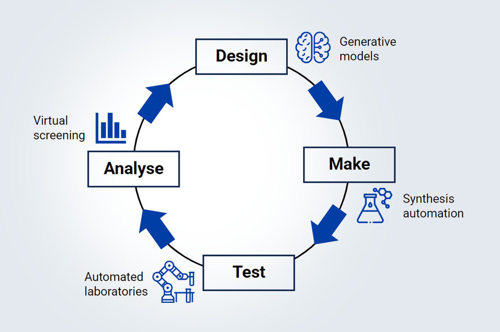

 [](https://opensource.org/licenses/MIT)
 [](https://github.com/psf/black)
[](https://github.com/GT4SD/molecular-design/actions/workflows/ci.yml)

# AI For Target Based Drug Design

The code in this repo aims to provide a complete computational pipeline for target-based molecular design. It consists of seven steps that runs several state-of-the-art deep learning models:
1. Installation
2. Train a virtual screening model
3. Generate molecules iteratively, filtered automatically by the screening model
4. Optimize molecules 
5. Filter the optimized molecules
6. Compute further physiochemical properties for manual inspection
7. Create synthesis routes for best candidates




## 1 - Setup

### 1a - Install [GT4SD](https://github.com/GT4SD/gt4sd-core) 
First we set up the environment.

```bash
git clone https://github.com/GT4SD/gt4sd-core.git
cd gt4sd-core/
# substitute with `conda_cpu_linux.yml` or `conda_cpu_max.yml` based on your OS
conda env create -f conda_gpu.yml
conda activate gt4sd
pip install gt4sd
pip uninstall --yes toxsmi && pip install toxsmi
```
For details on GT4SD see the [paper](https://www.nature.com/articles/s41524-023-01028-1).

### 1b - Optional download of affinity data from [BindingDB](https://www.bindingdb.org/bind/BindingDBRESTfulAPI.jsp)
NOTE: If you have custom data for your target, you can skip this step. But it may be useful to run it to (1) see the required data format and (2) augment your custom data.
Example of retrieving binding data for UniProt target P05067 (kinase):
```bash
python scripts/load_data.py \
    --uniprot P05067 \
    --affinity_type IC50 \
    --affinity_cutoff 10000 \
    --output_dir data/ \
    --train_size 0.8 \
    --binary_labels
```

## 2 - Train the virtual screening model [Toxsmi](https://pubs.rsc.org/en/content/articlehtml/2023/dd/d2dd00099g)

Assuming the data sets reside in the `data` folder either by running the step above or symlinking your own datasets,
you can start the training with the following command:
```
python scripts/train_toxsmi.py \
    --train data/train.csv \
    --test data/valid.csv \
    --smi data/mols.smi \
    --language tokenizer \
    --params config/toxsmi_conf.json \
    --model models \
    --name toxsmi_model
```
To change the batch size, number of epochs, etc., see `config/toxsmi_conf.json`.
For detailse, see the [Toxsmi paper](https://pubs.rsc.org/en/content/articlehtml/2023/dd/d2dd00099g).

## 3 - Generate molecules with [MoLeR](https://github.com/microsoft/molecule-generation)
This step uses an iterative procedure combining a substructure-driven generative model (MoLeR) with the previously trained virtual screening model (ToxSmi) to produce a set of candidate molecules with high predicted binding affinity.

NOTE: MoLeR is a *local* generative model, thus `good_docks.smi` gives you a way to condition the generative process. You can place their molecules with moieities that you would like to see in the final molecule. Or you take the best molecules from the affinity data that you have (see Step 1b). If you dont want to bias the model in any direction, we recommend to pass a large `.smi` file (>1000 molecules) with diverse chemical structures.

Here is an example of using the first five molecules:
```bash
head -n 5 data/mols.smi > data/good_docks.smi 
```

We generate molecules using the following command:
```
python scripts/moler_generate_toxsmi.py \
    --smi_path data/good_docks.smi \
    --param_path config/moler_conf.json \
    --output_path data/moler_filtered \
    --predictor_path models/toxsmi_model/weights/best_F1.pt
```
where `best_F1.pt` is the weights of the best toxsmi model.

To change the threshold, number of iterations, etc,. see `config/moler_conf.json`.
For details, read the [MoLeR paper](https://arxiv.org/abs/2103.03864).

## 4 - Generate more diverse molecules with [Regression Transformer](https://www.nature.com/articles/s42256-023-00639-z)
This step refines and optimizes the generated molecules from MoLeR in order to be more drug-like.

Generate the dataset
```bash
python scripts/prepare_rt_data.py \
    --smi_path data/moler_filtered/generated.csv \
    --output_path data/moler_filtered/generated_qed.csv 
```
```
python scripts/rt_generate.py \
    --smi_path data/moler_filtered/generated_qed.csv \
    --param_path config/rt_conf.json \
    --output_path data/rt
```

To change the batch size, tolerance, etc., see `config/rt_conf.json`.
For details, read the [Regression Transformer paper](https://www.nature.com/articles/s42256-023-00639-z).

## 5 - Run inference on [Toxsmi](https://pubs.rsc.org/en/content/articlehtml/2023/dd/d2dd00099g)
After generating a more diverse set of molecules, we screen the newly generated molecules with ToxSmi.
First we structure the input dataset by running:
```
python scripts/inference_dataset.py -i data/rt/qed_rt_conf_generated_qed/generated.csv
```
This generates `dummy_data.csv` and `generated.smi`. Run the inference:
```
python scripts/test_toxsmi.py \
    --model_path models/toxsmi_model \
    --smi_filepath generated.smi \
    --label_filepath dummy_data.csv \
    --checkpoint_name F1
```
this results in `models/toxsmi_model/results/dummy_data_F1_results_flat.csv` which contain the predictions.

## 6 - Computing properties with GT4SD
To ease postprocessing and manual inspection, we compute various physicochemical properties (logP, weight, rings counts, drug-likeness) with GT4SD.
```bash
python scripts/mol_properties.py \
    --smi_path models/toxsmi_model/results/dummy_data_F1_results_flat.csv \
    --output_path mol_props.csv 
```

## 7 - Retrosynthesis with [IBM RXN for Chemistry](https://rxn.app.accelerate.science/)
Last, to ease wet-lab synthesis, we use [IBM RXN for Chemistry](https://rxn.app.accelerate.science/) to predict potential synthesis routes for each candidate molecule.

```bash
pip install rxn4chemistry
```

A free API key can be generated at [RXN](https://rxn.app.accelerate.science/) by creating an account.
To run the retrosynthesis a `project_id` is also needed. After you created a project on the webapp, the
ID can be extracted from the url, which may look like this:
`https://rxn.app.accelerate.science/rxn/projects/<project_id_is_here>/test/dashboard`.

Since retrosynthesis is time consuming, it is recommended to rank your molecules and only retrosynthesize the  `top_n` ranked molecules.
Here is an example of taking the first molecule
```bash
head -n 2 data/rt/qed_rt_conf_generated_qed/generated.csv > selected_for_retro.csv
```

```bash
API_KEY=<your API key here>
PROJ_ID=<your project id here>
python scripts/retrosynthesis.py selected_for_retro.csv \
--api_key $API_KEY \
--project_id $PROJ_ID \
--steps 4 \
--timeout 100 \
--name my_retrosynthesis
```

For further information on RXN's retrosynthesis models see [Schwaller et al. (2020)](https://pubs.rsc.org/en/content/articlehtml/2020/sc/c9sc05704h) and [Zipoli et al. (2024)](https://www.nature.com/articles/s41524-024-01290-x).


## Citations

If you're using the code here, please cite the papers that are part of this pipeline
```bib
@article{manica2023accelerating,
  title={Accelerating material design with the generative toolkit for scientific discovery},
  author={Manica, Matteo and Born, Jannis and Cadow, Joris and Christofidellis, Dimitrios and Dave, Ashish and Clarke, Dean and Teukam, Yves Gaetan Nana and Giannone, Giorgio and Hoffman, Samuel C and Buchan, Matthew and others},
  journal={npj Computational Materials},
  volume={9},
  number={1},
  pages={69},
  year={2023},
  publisher={Nature Publishing Group UK London}
}
@article{born2023regression,
  title={Regression transformer enables concurrent sequence regression and generation for molecular language modelling},
  author={Born, Jannis and Manica, Matteo},
  journal={Nature Machine Intelligence},
  volume={5},
  number={4},
  pages={432--444},
  year={2023},
  publisher={Nature Publishing Group UK London}
}
@article{born2023chemical,
    title={Chemical representation learning for toxicity prediction},
    author={Born, Jannis and Markert, Greta and Janakarajan, Nikita and Kimber, Talia B and Volkamer, Andrea and Mart{\'\i}nez, Mar{\'\i}a Rodr{\'\i}guez and Manica, Matteo},
    journal={Digital Discovery},
    volume={2},
    number={3},
    pages={674--691},
    year={2023},
    publisher={Royal Society of Chemistry}
}
@inproceedings{maziarz2022learning,
    title={Learning to Extend Molecular Scaffolds with Structural Motifs},
    author={Krzysztof Maziarz and Henry Richard Jackson-Flux and Pashmina Cameron and Finton Sirockin and Nadine Schneider and Nikolaus Stiefl and Marwin Segler and Marc Brockschmidt},
    booktitle={International Conference on Learning Representations},
    year={2022},
    url={https://openreview.net/forum?id=ZTsoE8G3GG}
}
@article{zipoli2024growing,
  title={Growing strings in a chemical reaction space for searching retrosynthesis pathways},
  author={Zipoli, Federico and Baldassari, Carlo and Manica, Matteo and Born, Jannis and Laino, Teodoro},
  journal={npj Computational Materials},
  volume={10},
  number={1},
  pages={101},
  year={2024},
  publisher={Nature Publishing Group UK London}
}
@article{schwaller2020predicting,
  title={Predicting retrosynthetic pathways using transformer-based models and a hyper-graph exploration strategy},
  author={Schwaller, Philippe and Petraglia, Riccardo and Zullo, Valerio and Nair, Vishnu H and Haeuselmann, Rico Andreas and Pisoni, Riccardo and Bekas, Costas and Iuliano, Anna and Laino, Teodoro},
  journal={Chemical science},
  volume={11},
  number={12},
  pages={3316--3325},
  year={2020},
  publisher={Royal Society of Chemistry}
}
```