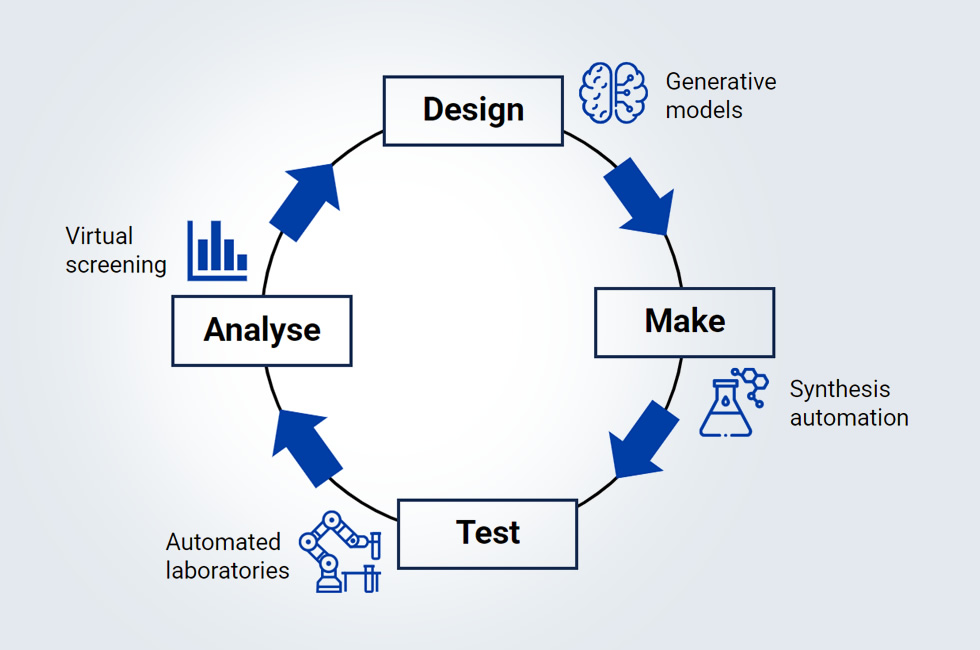

[](https://opensource.org/licenses/MIT)
[](https://github.com/psf/black)
[](https://github.com/GT4SD/molecular-design/actions/workflows/ci.yml)

# AI for Target-Based Molecular Design

This repository implements the computational core of a target-based molecular
discovery workflow. Starting from target-specific activity data, it trains a
SMILES-based virtual-screening model, generates and optimizes candidate
molecules, re-scores and characterizes them, and proposes retrosynthetic routes
for the selected compounds.

The workflow connects the following stages:

1. retrieve `IC50` or `Kd` measurements from BindingDB, or supply custom data;
2. train a target-specific [ToxSmi](https://pubs.rsc.org/en/content/articlehtml/2023/dd/d2dd00099g)
   predictor;
3. perform scaffold- and motif-conditioned generation with
   [MoLeR](https://github.com/microsoft/molecule-generation), iteratively retaining
   candidates that pass the ToxSmi threshold;
4. optimize molecular structure and QED with the
   [Regression Transformer](https://www.nature.com/articles/s42256-023-00639-z);
5. re-score the optimized molecules with the trained ToxSmi checkpoint;
6. calculate physicochemical descriptors for candidate prioritization; and
7. submit selected candidates to IBM RXN for retrosynthetic analysis.

## Used in autonomous closed-loop molecular discovery

> **This pipeline was used for the molecular-design component of
> [*Toward fully autonomous closed-loop molecular discovery – A case study on
> JAK targets*](https://doi.org/10.26434/chemrxiv-2026-q7xdt) (ChemRxiv, 2026).**

In that JAK-family case study, the computational workflow was connected to
IBM's RoboRXN synthesis automation and Arctoris' Ulysses automated *in vitro*
screening platform. The study reports two Design-Make-Test-Analyze (DMTA)
cycles and 36 synthesized compounds. Candidates from the second cycle had
significantly improved pIC50 and ligand efficiency relative to the first cycle
(`p < 0.001`).

This repository provides the reusable data preparation, predictive modeling,
molecular generation, *in silico* filtering, property calculation, and
retrosynthesis stages. RoboRXN orchestration, Ulysses assay automation, and the
physical experimental stages reported in the paper are external to this
repository; consequently, the commands below document the computational
pipeline rather than a one-command reproduction of the full experimental
campaign.

<p align="center">
    
</p>

## 1 — Setup


### 1a — Install [GT4SD](https://github.com/GT4SD/gt4sd-core)

Create and activate the GT4SD environment:

```bash
git clone https://github.com/GT4SD/gt4sd-core.git
cd gt4sd-core/
# substitute with `conda_cpu_linux.yml` or `conda_cpu_max.yml` based on your OS
conda env create -f conda_gpu.yml
conda activate gt4sd
pip install gt4sd
pip uninstall --yes toxsmi && pip install toxsmi
```

For architectural and model details, see the
[GT4SD paper](https://www.nature.com/articles/s41524-023-01028-1).

### 1b — Prepare affinity data

If you already have target-specific measurements, provide them using the file
contracts below. Otherwise, `load_data.py` can retrieve data from the
[BindingDB REST API](https://www.bindingdb.org/bind/BindingDBRESTfulAPI.jsp).
For example:

```bash
python scripts/load_data.py \
    --uniprot P05067 \
    --affinity_type IC50 \
    --affinity_cutoff 10000 \
    --output_dir data/ \
    --train_size 0.8 \
    --binary_labels
```

The loader keeps records matching `--affinity_type`, drops incomplete rows,
converts nanomolar measurements to pAffinity, takes the median when BindingDB
contains repeated measurements for the same SMILES, and performs a reproducible
train/validation split (`random_state=1911`). With `--binary_labels`, values
above pAffinity 6 are assigned to the positive class.

It writes:

- `data/mols.smi`: tab-separated `SMILES` and `mol_id`, without a header;
- `data/train.csv`: `Label,sampling_frequency,mol_id`; and
- `data/valid.csv`: the same schema as the training file.

The accession and settings above are an illustrative example, not the exact JAK
study configuration. For a custom dataset, preserve these schemas and ensure
that every `mol_id` in the label files occurs in the `.smi` file.

## 2 — Train the virtual-screening model with [ToxSmi](https://pubs.rsc.org/en/content/articlehtml/2023/dd/d2dd00099g)

Train ToxSmi after generating the files above or linking compatible custom data
into `data/`:

```bash
python scripts/train_toxsmi.py \
    --train data/train.csv \
    --test data/valid.csv \
    --smi data/mols.smi \
    --language tokenizer \
    --params config/toxsmi_conf.json \
    --model models \
    --name toxsmi_model
```

The default [`config/toxsmi_conf.json`](config/toxsmi_conf.json) specifies a
multi-convolution attention model with a learned 256-dimensional SMILES
embedding, convolution kernels of 3, 5, 11, and 17 tokens, five score-ensemble
members, SMILES augmentation during training, and canonical SMILES at
validation time. It uses binary cross-entropy for the binary labels generated
in Step 1. Adjust the task, training length, batch size, and architecture in
that file for the target and dataset at hand. Model parameters, the serialized
tokenizer, weights, and evaluation results are written beneath
`models/toxsmi_model/`.

See the [ToxSmi paper](https://pubs.rsc.org/en/content/articlehtml/2023/dd/d2dd00099g)
for the model architecture and representation-learning methodology.

## 3 — Generate and filter molecules with [MoLeR](https://github.com/microsoft/molecule-generation)

This stage combines the substructure-driven MoLeR generator with the trained
ToxSmi predictor. For every iteration, the script extracts scaffolds and
structural motifs from the current seed pool, samples molecules conditioned on
those substructures, canonicalizes the generated SMILES, requires at least one
aromatic ring, and retains candidates whose predictor score is greater than
`theta`. Passing candidates are added to the seed pool for the next iteration.

MoLeR is locally conditioned, so the contents of `good_docks.smi` determine the
scaffolds and motifs emphasized by generation. Use selected active compounds
when those substructures should be preserved. To reduce seed bias, provide a
large and structurally diverse seed set instead. The input is a headerless,
tab-separated file whose first column contains SMILES.

For a minimal example, select the first five molecules from Step 1:

```bash
head -n 5 data/mols.smi > data/good_docks.smi
```

Generate and filter candidates:

```bash
python scripts/moler_generate_toxsmi.py \
    --smi_path data/good_docks.smi \
    --param_path config/moler_conf.json \
    --output_path data/moler_filtered \
    --predictor_path models/toxsmi_model/weights/best_F1.pt
```

Here, `best_F1.pt` is the selected ToxSmi checkpoint. Configuration options in
[`config/moler_conf.json`](config/moler_conf.json) include the number of
molecules collected per iteration before filtering, number of iterations, beam
and sample sizes, sampling noise (`max_sigma`), and predictor threshold
(`theta`). The checked-in values are intentionally small and are suitable for
exercising the workflow, not for a production discovery campaign. The unique
candidates are ranked by their ToxSmi `Label` and written to
`data/moler_filtered/generated.csv`.

For model details, read the [MoLeR paper](https://arxiv.org/abs/2103.03864).

## 4 — Optimize molecules with the [Regression Transformer](https://www.nature.com/articles/s42256-023-00639-z)

First, calculate QED for every MoLeR candidate. This adds the property token
column `<qed>` expected by the QED-conditioned Regression Transformer:

```bash
python scripts/prepare_rt_data.py \
    --smi_path data/moler_filtered/generated.csv \
    --output_path data/moler_filtered/generated_qed.csv
```

Then run property-conditioned generation:

```bash
python scripts/rt_generate.py \
    --smi_path data/moler_filtered/generated_qed.csv \
    --param_path config/rt_conf.json \
    --output_path data/rt
```

For each seed, the script masks a random fraction of its representation and
requests a QED increase equal to 10% of the model's supported property range,
capped at 98% of the upper bound. It de-duplicates the results and retains
aromatic molecules. Control the maximum masked fraction, sampling temperature,
tolerance, batch size, and optional decoration mode in
[`config/rt_conf.json`](config/rt_conf.json). The command above writes
`data/rt/qed_rt_conf_generated_qed/generated.csv`; the directory name is derived
from the model version, configuration filename, and input filename.

For methodological details, read the
[Regression Transformer paper](https://www.nature.com/articles/s42256-023-00639-z).

## 5 — Re-score optimized molecules with ToxSmi

Convert the Regression Transformer output into the two files expected by the
ToxSmi inference loader:

```bash
python scripts/inference_dataset.py -i data/rt/qed_rt_conf_generated_qed/generated.csv
```

This writes `generated.smi` and `dummy_data.csv` in the current directory. The
dummy labels satisfy the annotated-dataset interface and are not experimental
measurements. Run inference using the desired checkpoint:

```bash
python scripts/test_toxsmi.py \
    --model_path models/toxsmi_model \
    --smi_filepath generated.smi \
    --label_filepath dummy_data.csv \
    --checkpoint_name F1
```

The checkpoint selector matches a filename containing `F1`. Predictions are
written to
`models/toxsmi_model/results/dummy_data_F1_results_flat.csv`, with one row per
molecule and task. Pass `--confidence` to additionally calculate epistemic
confidence by Monte Carlo dropout and aleatoric confidence by test-time SMILES
augmentation.

## 6 — Compute physicochemical properties

Calculate RDKit descriptors for ranking and manual review:

```bash
python scripts/mol_properties.py \
    --smi_path models/toxsmi_model/results/dummy_data_F1_results_flat.csv \
    --output_path mol_props.csv
```

The output retains `SMILES`, copies the model `Prediction` into `IC50`, and adds
molecular weight, logP, QED, topological polar surface area, hydrogen-bond donor
and acceptor counts, rotatable bonds, total and aromatic ring counts, and heavy
atom count. Despite the legacy `IC50` output-column name, its value has the same
semantics as the trained model's prediction; verify whether that model is a
classifier or regressor before interpreting it as an affinity.

## 7 — Retrosynthesis with [IBM RXN for Chemistry](https://rxn.app.accelerate.science/)

Use IBM RXN to propose retrosynthetic routes for the highest-priority
candidates:

```bash
pip install rxn4chemistry
```

Create an RXN account and project, then obtain an API key. The project ID is the
value in a dashboard URL of the form:
`https://rxn.app.accelerate.science/rxn/projects/<project_id_is_here>/test/dashboard`.

Retrosynthesis is comparatively expensive, so rank the candidates first and
submit only the desired top set. The following command keeps the CSV header and
first candidate:

```bash
head -n 2 data/rt/qed_rt_conf_generated_qed/generated.csv > selected_for_retro.csv
```

```bash
API_KEY="your-api-key"
PROJ_ID="your-project-id"
python scripts/retrosynthesis.py selected_for_retro.csv \
    --api_key "$API_KEY" \
    --project_id "$PROJ_ID" \
    --steps 4 \
    --timeout 100 \
    --name my_retrosynthesis
```

The script submits each row's `SMILES`, requests routes with the selected search
depth and beam count, and stores one JSON response per molecule under
`results/selected_for_retro/`. Existing result files are not submitted again.
For further information on RXN's retrosynthesis models, see
[Schwaller et al. (2020)](https://pubs.rsc.org/en/content/articlehtml/2020/sc/c9sc05704h)
and
[Zipoli et al. (2024)](https://www.nature.com/articles/s41524-024-01290-x).

The full illustrative sequence is also available in
[`example_pipeline.sh`](example_pipeline.sh). Set `API_KEY` and `PROJ_ID` before
running its retrosynthesis stage.

## Citation

If you use this pipeline, please cite the paper in which it was applied:

```bib
@article{born2026toward,
  title = {Toward fully autonomous closed-loop molecular discovery -- A case study on {JAK} targets},
  author = {Born, Jannis and Baldassari, Carlo and Grabocka, Doriela and
            Cardinale, Antonio and Schilter, Oliver and Castrogiovanni, Alessandro and
            Leonov, Artem and Skogh, Filip and Singh, Jeeven and Xiong, Yaoyao and
            Evans, John and Fleming, Thomas and Laino, Teodoro and Manica, Matteo},
  year = {2026},
  month = jan,
  publisher = {American Chemical Society (ACS)},
  doi = {10.26434/chemrxiv-2026-q7xdt},
  url = {https://doi.org/10.26434/chemrxiv-2026-q7xdt},
  note = {ChemRxiv preprint}
}
```
